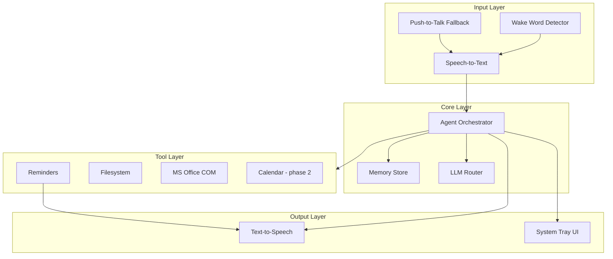
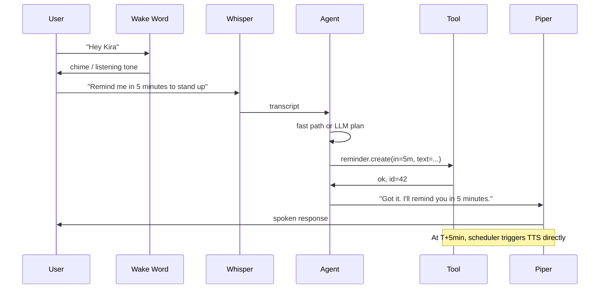

# Kira — System Architecture

> Voice-first personal AI assistant for Windows. Local & open-source by default.
> See also: [DISCOVERY.md](./DISCOVERY.md) · [MVP_SCOPE.md](./MVP_SCOPE.md)

---

## 1. High-level overview

Kira runs as a **background Windows service** with an optional **system-tray UI**. The user says **"Hey Kira"**, speaks a command, and Kira **responds by voice**.



**Design principles**

1. **Local first** — voice, inference, files, and memory stay on-device.
2. **Modular tools** — each capability (files, reminders, Office) is a pluggable tool the agent calls.
3. **Phased complexity** — ship a thin vertical slice, then add tools and integrations.
4. **Offline by default** — cloud (OpenRouter) is opt-in per task.

---

## 2. Runtime components

### 2.1 Kira Daemon (`kira-daemon`)

Always-on Python process (Windows Service or background app).

| Responsibility | Details |
|----------------|---------|
| Wake word loop | Listens on default mic via `openWakeWord` custom "Hey Kira" model |
| Audio pipeline | Captures utterance after wake → sends to STT |
| Session state | Idle → Listening → Processing → Speaking |
| Reminder scheduler | Background thread; fires TTS alerts at due time |
| Tool execution | Calls registered tools with sandboxed paths |

**Data directory:** `%USERPROFILE%\.kira\`

```
.kira/
├── config.yaml          # user settings, allowed paths, quiet hours
├── memory.db            # SQLite: reminders, chat log, user facts
├── profile.md           # human-readable memory export
├── logs/
└── models/              # optional local model cache
```

### 2.2 Agent Orchestrator

Lightweight agent loop (LangGraph or custom ReAct-style).

```
User speech (text)
    → intent + tool selection (LLM)
    → execute tool(s)
    → compose spoken response (LLM or template)
    → TTS
```

**LLM routing**

| Route | When | Backend |
|-------|------|---------|
| **Local (default)** | Reminders, file ops, simple Q&A | Ollama (`llama3.1:8b` or similar) |
| **OpenRouter (opt-in)** | User says "use cloud" / hard reasoning | OpenRouter API, model from config |
| **No LLM** | Deterministic commands | Regex + tool direct call (fast path) |

Fast path examples (skip LLM for speed):
- "Remind me in 10 minutes to …"
- "Open file …"
- "List files in Desktop"

### 2.3 Voice stack (all open-source)

| Stage | Library | Notes |
|-------|---------|-------|
| Wake word | [openWakeWord](https://github.com/dscripka/openWakeWord) | Train/customize "hey kira"; low CPU |
| STT | [faster-whisper](https://github.com/SYSTRAN/faster-whisper) | `base` or `small` model; CUDA if GPU |
| TTS | [Piper](https://github.com/rhasspy/piper) | Fast, offline, Indian English voice pack |
| VAD | [silero-vad](https://github.com/snakers4/silero-vad) | End-of-speech detection |

**Latency budget (simple command)**

| Step | Target |
|------|--------|
| Wake word → start listening | < 100 ms |
| STT | < 1 s |
| Agent + tool | < 1 s |
| TTS first audio | < 500 ms |
| **Total** | **< 2 s** |

### 2.4 Tool layer

Each tool exposes a JSON schema the LLM can call.

| Tool | Phase | Implementation |
|------|-------|----------------|
| `reminder` | 1 | SQLite + scheduler; create/list/cancel/snooze |
| `filesystem` | 1 | Browse, search, open, create, rename, delete (allowlisted roots) |
| `office` | 2 | `pywin32` COM automation for Word/Excel/PowerPoint |
| `memory` | 2 | Read/write user facts to SQLite + profile.md |
| `notes` | 2 | Local markdown files in `.kira/notes/` |
| `calendar` | 3 | Google Calendar API (OAuth) |
| `email` | 3 | Gmail API |
| `openrouter` | 3 | Explicit cloud LLM tool |
| `web_search` | 3 | Optional, requires internet |

**Filesystem sandbox:** Only paths in `config.yaml` → Documents, Desktop, custom project folders. Delete requires confirmation phrase.

### 2.5 Desktop UI (optional, phase 1 minimal)

**Tauri** or **system-tray only** for v1:

- Tray icon: status (listening / idle / speaking)
- Push-to-talk hotkey (e.g. `Ctrl+Shift+K`)
- Conversation log (scrollable text)
- Settings: mic, allowed folders, quiet hours, Ollama model

Full Electron/Tauri settings app can come in phase 2.

### 2.6 Android client (phase 4)

- Kotlin app; wake word on-device
- Sync via local network or self-hosted sync server (not cloud SaaS)
- Shares reminders + memory with desktop

---

## 3. Tech stack summary

| Layer | Choice | Why |
|-------|--------|-----|
| Language | **Python 3.11+** | Best ecosystem for Whisper, Ollama, COM, agents |
| Packaging | **uv** or **poetry** | Reproducible deps |
| Agent | **LangGraph** (or minimal custom) | Tool calling, state, extensibility |
| LLM local | **Ollama** | Simple API, model management |
| LLM cloud | **OpenRouter** | Model flexibility, one API |
| DB | **SQLite** | Reminders, logs, memory |
| Office | **pywin32** | Native Word/Excel/PPT automation |
| UI | **Tauri 2** (Rust + web) or tray-only | Lightweight vs Electron |
| Android | **Kotlin** | Phase 4 |

---

## 4. Request lifecycle (detailed)



---

## 5. Security model

| Concern | Approach |
|---------|----------|
| File access | Allowlisted directories only; no raw `C:\` |
| Destructive ops | Voice confirmation: "Yes, delete it" |
| Cloud egress | Blocked unless OpenRouter tool explicitly invoked |
| Secrets | `.kira/secrets.env` gitignored; API keys never in logs |
| Process isolation | Tools run in-process v1; subprocess sandbox phase 3 |
| Encryption | SQLite encryption at rest — phase 2 |

---

## 6. Deployment (Windows)

### Prerequisites

- Windows 10/11
- Python 3.11+
- [Ollama](https://ollama.com/) installed + model pulled
- MS Office desktop (phase 2)
- Optional: NVIDIA GPU + CUDA for faster Whisper/Ollama

### Install flow (target)

```powershell
# Clone repo
git clone https://github.com/you/kira.git
cd kira

# Install deps
uv sync

# Download voice models (Whisper, Piper, wake word)
python scripts/setup_models.py

# Configure
copy config.example.yaml %USERPROFILE%\.kira\config.yaml

# Run daemon
python -m kira daemon

# Optional: install as Windows service
python -m kira install-service
```

---

## 7. Phased roadmap

| Phase | Focus | Key deliverables |
|-------|-------|------------------|
| **1 — MVP** | Voice loop + reminders + files | Wake word, STT, TTS, Ollama, file CRUD, reminder scheduler |
| **2** | Office + memory + proactive | COM automation, user profile, spoken reminder alerts, notes |
| **3** | Cloud + integrations | OpenRouter router, Google Calendar/Gmail, dev helper, encrypted DB |
| **4** | Mobile + polish | Android app, sync, barge-in, smart home |

See [MVP_SCOPE.md](./MVP_SCOPE.md) for phase 1 detail.

---

## 8. Repository structure (planned)

```
kira/
├── docs/
│   ├── DISCOVERY.md
│   ├── ARCHITECTURE.md
│   └── MVP_SCOPE.md
├── src/kira/
│   ├── __init__.py
│   ├── daemon.py           # main event loop
│   ├── agent/
│   │   ├── orchestrator.py
│   │   ├── prompts.py
│   │   └── router.py       # local vs openrouter
│   ├── voice/
│   │   ├── wake_word.py
│   │   ├── stt.py
│   │   ├── tts.py
│   │   └── audio.py
│   ├── tools/
│   │   ├── base.py
│   │   ├── reminder.py
│   │   ├── filesystem.py
│   │   └── office.py       # phase 2
│   ├── memory/
│   │   └── store.py
│   └── ui/
│       └── tray.py
├── config.example.yaml
├── pyproject.toml
├── scripts/
│   └── setup_models.py
└── README.md
```

---

## 9. Open decisions (resolve during implementation)

1. **Ollama model** — benchmark `llama3.1:8b` vs `mistral:7b` on your GPU/CPU.
2. **Wake word training** — record ~50 "Hey Kira" samples for custom openWakeWord model.
3. **Tauri vs tray-only** — start tray-only for speed; add Tauri when settings UI grows.
4. **LangGraph vs custom** — custom loop if LangGraph feels heavy for v1.

---

*Last updated: architecture v1 aligned with DISCOVERY.md*
